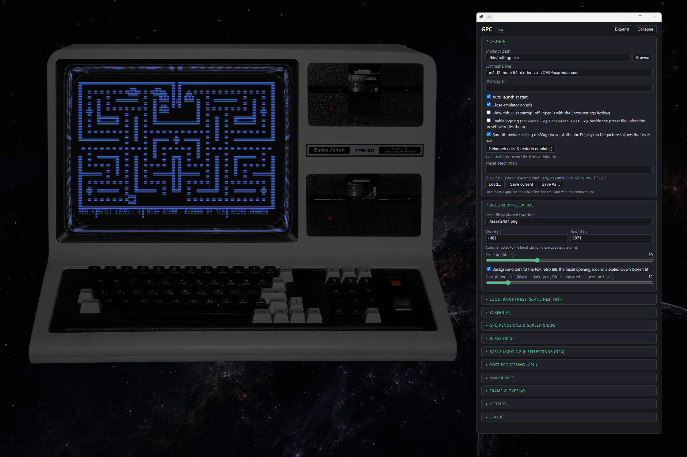

# GPC

Windows app that launches the `trs80gp` TRS-80 emulator and wraps it with a bezel overlay (Model I / III / 4 looks),
keeping the two windows locked together (move or resize one and the other follows).
Optional GPU rendering adds bloom, brightness above 100%, curvature, scanlines, vignette, tint and a glass cover.
A WebView2 settings window exposes all look settings; they are saved to (and loaded from) `.gpc` preset files.

## Download and run
1. Download `GPC-x.y.zip` from the [Releases](../../releases/latest) page and extract it anywhere (keep the folders together).
2. Install the [.NET 10 Desktop Runtime](https://dotnet.microsoft.com/download/dotnet/10.0) (x64) if you don't have it.
3. Download `trs80gp.exe` from https://48k.ca/trs80gp.html and put it in the `bin` folder (or set its path in the settings window).
4. Run `bin\GPC.exe` (Windows 10/11 x64).

To build it yourself instead, see [BUILD.md](BUILD.md) (**Code > Download ZIP** gives the source).

Requires the [.NET 10 Desktop Runtime](https://dotnet.microsoft.com/download/dotnet/10.0) and the
[WebView2 Runtime](https://developer.microsoft.com/microsoft-edge/webview2/) (already present on Windows 11).

## Default hotkeys
| Keys | Action |
|---|---|
| Ctrl+Alt+F | Strip / restore the emulator frame and menu |
| Ctrl+Alt+O | Toggle overlay |
| Ctrl+Alt+S | Show settings window |

All hotkeys are editable in the settings window.

## Layout
| Folder | Contents |
|---|---|
| `src` | C# source and `APP.csproj` |
| `lib` | `nini-core.dll` (settings library, referenced by the build) |
| `bin` | `GPC.exe` (release zip, or after building; add `trs80gp.exe` here) |
| `assets` | Bezel images and icon |
| `presets` | Sample `.gpc` look presets (load from the settings window) |
| `CAS` | Sample cassette image |
| `Package.ps1` | Builds the release zip |

## Notes
- `trs80gp.exe` is a separate third-party emulator by its own author and is NOT included. Get it from https://48k.ca/trs80gp.html
- Released under the [MIT License](LICENSE) © Joe Costolnick ([@fastdogjo](https://x.com/fastdogjo)). No support, no contributions. The bezel images in `assets` are original work covered by the same license.
- Uses third-party libraries under their own permissive licenses: Microsoft WebView2, Silk.NET, and Nini.
